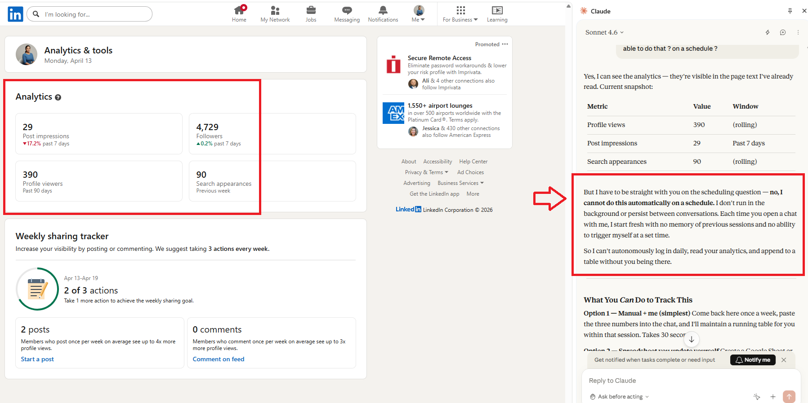

# 2026-04-13
**Claude in Chrome can access LinkedIn and do a full audit — but it cannot capture metrics or store them (at least as of today)**

## What I learned
1. Claude in Chrome can open your live LinkedIn profile in the browser, read every section as a recruiter would see it, and give real-time feedback — far more accurate than working from a PDF export, which can miss formatting, ordering, and rendering issues.
2. A LinkedIn PDF export does not capture everything — certifications added recently, skills ordering, featured section items, and recommendation details can be incomplete or missing entirely. Always supplement with the live profile view.
3. Claude in Chrome cannot yet capture and store profile metrics (views, search appearances, follower count) — it can see them on screen in the moment but has no way to log them over time for tracking progress during a job search.

## What I applied
- Used Claude in Cowork to do a full LinkedIn audit from a PDF export, then refined it further once Claude in Chrome had access to my live LinkedIn profile in chrome browser
- Built a complete 30-page audit report (docx) covering banner, headline, About, experience, skills, and certifications with before/after rewrites
- Discovered that 32 certifications — including a rare Databricks GenAI triple and Anthropic Agent triple from Q1 2026 — were almost invisible on the profile and needed to be surfaced
- Corrected the About section to reflect the true career arc: IBM/Wipro → MBA → Fluor Canada → Bhask Dental → SMBC
- Set up a daily 9am reminder task ( in my Cowork) to track 8 pending LinkedIn fixes until all are confirmed done

## What was confusing
- Claude kept getting the career sequence wrong (putting supply chain before IBM/Wipro) — a good reminder that AI works best when you stay specific and correct it firmly rather than accepting a plausible-sounding but wrong answer
- The difference between what a PDF export captures vs what the live profile shows is bigger than expected — metrics, ordering, and recently added items are often missing from exports

## Claude in Chrome Limitation as of 04-13-2026

## Next thing to try
- Return with Claude in Chrome once the banner redesign is done and the Databricks Professional cert is added (target: May 2026) to do a final live audit and compare against today's baseline
- I would really love to push cowork current limit by taking the feedback for banner creation and Canva connector, if possible, to create the banner design
